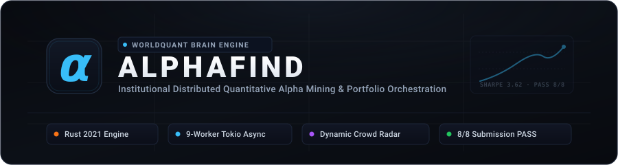

<p align="center">
  <a href="https://github.com/vtp772002/alphafind">
    
  </a>
</p>

<p align="center">
  <b>Institutional Distributed Quantitative Alpha Mining & Portfolio Orchestration Engine for WorldQuant BRAIN</b><br>
  Built natively in Rust. High-throughput, concurrent, and mathematically rigorous.
</p>

<p align="center">
  <a href="docs/QUICKSTART.md">Quickstart</a> ·
  <a href="docs/CLI_REFERENCE.md">CLI Reference</a> ·
  <a href="docs/METHODOLOGY.md">Methodology</a> ·
  <a href="docs/ARCHITECTURE.md">Architecture</a> ·
  <a href="docs/BRAIN_KNOWLEDGE_GRAPH.md">Knowledge Graph</a>
</p>

<p align="center">
  <a href="https://www.rust-lang.org/"></a>
  <a href="https://platform.worldquantbrain.com/"></a>
  <a href="https://tokio.rs/"></a>
  <a href="docs/METHODOLOGY.md"></a>
  <a href="https://github.com/vtp772002/alphafind/stargazers"></a>
  <a href="LICENSE"></a>
</p>

---

## 📌 About

**AlphaFind** is an institutional-grade quantitative alpha discovery and portfolio orchestration framework engineered natively in **Rust** for the **WorldQuant BRAIN** algorithmic trading platform.

Quantitative research at scale requires exploring thousands of mathematical formulations, optimizing decay parameters, eliminating self-correlation, and adhering to strict platform risk constraints. Performing this through manual web interfaces or ad-hoc scripts leads to quota starvation, portfolio dilution, and execution errors.

AlphaFind provides a high-performance CLI engine that coordinates **scalable asynchronous concurrency (up to 9 parallel workers)**, sweeps decay ranges, applies convex non-linear transformations, audits pairwise Pearson correlation in microseconds, and pre-validates all **8/8 mandatory In-Sample platform checks** prior to Out-of-Sample submission.

---

## ⚡ Why AlphaFind

| Capability | Ad-hoc Scripts / Web UI | AlphaFind Engine |
|:---|:---|:---|
| **Execution Architecture** | Single-threaded, synchronous | **9-Worker Tokio Async Event Loop** |
| **Worker Orchestration** | Single session, manual queueing | **Multi-Session Async Pooling** (Configurable workers) |
| **Transfer Safety** | Manual copy-pasting across tabs | **Atomic Transfer Lock** for Main verification |
| **Correlation Auditing** | Slow web UI / manual calculations | **Microsecond Vector Pearson Matrix** ($\le 0.15$ target) |
| **Platform Compliance** | Trial-and-error submission rejections | **Automated 8/8 Pre-Validation** (`alphafind check`) |
| **Decay & Convexity Tuning**| Manual parameter guessing | **Autonomous Decay Sweeps & Power Transformations** |
| **Memory Footprint** | Heavy Python / Electron runtime | **Native Rust Binary** (~15 MB RAM, zero GC pause) |

---

## 📊 Supported Factor Pillars & Universes

### Factor Pillars
| Pillar | Economic Focus & Underlying Data | Default Universe | Neutralization |
|:---|:---|:---:|:---:|
| **`OPTIONS`** | Volatility Surface, Term Structure, Skew, VRP | `TOP1000` / `TOP3000` | `MARKET` / `SUBINDUSTRY` |
| **`ANALYST`** | Consensus EPS Revisions, Price Targets, Revisions Drift | `TOP500` | `SECTOR` / `MARKET` |
| **`MICRO`** | VWAP Slippage, Order Imbalance, Liquidity Shocks | `TOP1000` | `SUBINDUSTRY` |
| **`QUAL`** | Fundamental Quality, Accruals, Cash Flow Spreads | `TOP1000` / `TOP500` | `SUBINDUSTRY` |
| **`RISK`** | Idiosyncratic Risk, Unsystematic Volatility Curvature | `TOP1000` / `TOP500` | `SUBINDUSTRY` |
| **`SHORT`** | Short Interest Dynamics, Borrow Supply Constraints | `TOP2000` / `TOP1000` | `MARKET` |

### Equity Universes
| Universe | Description | Institutional Role |
|:---|:---|:---|
| **`TOP3000`** | Broad-market US equities | Micro/small-to-large cap idiosyncratic signals |
| **`TOP1000`** | Liquid large and mid-cap US equities | Core institutional testing universe (default) |
| **`TOP500`** | Large-cap US equities (S&P 500 equivalent) | High-capacity fundamental & analyst revisions |
| **`TOP200`** | Mega-cap US equities | Highest liquidity, lowest market impact |

---

## 🚀 Quickstart

### 1-Line Automated Install
Deploy instantly on macOS or Linux with live progress tracking:

```bash
curl -# -fsSL https://raw.githubusercontent.com/vtp772002/alphafind/main/install.sh | bash
```

```text
  [1/5] Verifying toolchain        [██████████████████████] 100% Rust 1.85.0 (OK)
  [2/5] Downloading repository     [██████████████████████] 100% Complete
  [3/5] Compiling release engine   [██████████████████████] 100% Optimized build ready
  [4/5] Installing binary to PATH  [██████████████████████] 100% ~/.cargo/bin/alphafind
  [5/5] Configuring environment    [██████████████████████] 100% .env initialized
```

### 3-Step Workflow
```bash
# 1. Configure BRAIN credentials
cp .env.example .env && nano .env

# 2. Authenticate all configured accounts
alphafind auth

# 3. Launch distributed 9-worker screening
alphafind screen --pillar OPTIONS --universe TOP1000 --min-fitness 1.50
```

👉 **For manual compilation and detailed prerequisites, see [Quickstart Guide](docs/QUICKSTART.md).**

---

## 📖 CLI Commands at a Glance

| Command | Syntax | Primary Purpose |
|:---|:---|:---|
| **`auth`** | `alphafind auth` | Authenticate all configured BRAIN accounts concurrently |
| **`sync`** | `alphafind sync` | Synchronize active Out-of-Sample portfolio into local cache |
| **`portfolio`** | `alphafind portfolio` | Simulate merged multi-alpha Out-of-Sample portfolio Sharpe & risk |
| **`sim`** | `alphafind sim --expr "..."` | Simulate an individual FastExpr formula backtest directly |
| **`screen`** | `alphafind screen --pillar <P>` | Launch distributed candidate screening with async concurrency |
| **`check`** | `alphafind check <ALPHA_ID>` | Verify the 8 mandatory In-Sample platform submission checks |
| **`audit`** | `alphafind audit <ALPHA_ID>` | Run 1,236-day Pearson correlation audit against active portfolio |
| **`submit`** | `alphafind submit <ALPHA_ID>` | Submit an Alpha to Out-of-Sample (OS) after 8/8 PASS verification |

👉 **For exhaustive options, flags, and workflow examples, see [CLI Command Reference](docs/CLI_REFERENCE.md).**

---

## 🏛️ System Architecture

```text
┌────────────────────────────────────────────────────────────────────────┐
│        TIER 1: TAXONOMY & ORTHOGONAL HYPOTHESIS ENGINE                 │
│   ├── src/taxonomy.rs   : 6 Economic Factor Pillars & Hypothesis Gen   │
│   ├── docs/BRAIN_KNOWLEDGE_GRAPH.md : 66 Operators & Diagnostics       │
│   └── data/             : Local Field Schemas & Profiling Metadata     │
└───────────────────────────────────┬────────────────────────────────────┘
                                    │
┌───────────────────────────────────┴────────────────────────────────────┐
│        TIER 2: DISTRIBUTED COMPUTE ENGINE (Multi-Worker Concurrency)   │
│   ├── src/screener.rs   : Asynchronous Parallel Tokio 9-Worker Engine  │
│   ├── src/client.rs     : Async BrainClient + Session Cookie + Backoff │
│   ├── src/autotuner.rs  : Autonomous Decay Sweeps & Convex Optimizer   │
│   └── transfer_lock     : Thread-Safe Verification Lock on Main        │
└───────────────────────────────────┬────────────────────────────────────┘
                                    │
┌───────────────────────────────────┴────────────────────────────────────┐
│        TIER 3: CORRELATION ENGINE & AUDIT GUARD                        │
│   ├── src/correlation.rs: Microsecond Pearson Matrix & Merge Simulator │
│   ├── ~/.cache/alphafind: Disk-Cached Daily PnL Baseline               │
│   └── portfolio_os.json : Master Active Out-of-Sample Portfolio Cache  │
└───────────────────────────────────┬────────────────────────────────────┘
                                    │
┌───────────────────────────────────┴────────────────────────────────────┐
│        TIER 4: SUBMISSION VERIFICATION & DISPATCH                      │
│   ├── src/main.rs       : Unified High-Performance CLI (alphafind)     │
│   ├── GET /check        : Official 8/8 Mandatory In-Sample PASS Engine │
│   └── POST /submit      : Direct API Submission & Institutional Tagging│
└────────────────────────────────────────────────────────────────────────┘
```

👉 **For full concurrency diagrams and engine specifications, see [Architecture Guide](docs/ARCHITECTURE.md).**

---

## 📚 Documentation Index

All technical and quantitative documentation is organized within the [`docs/`](docs/) directory:

| Document | Description |
|:---|:---|
| 🚀 [**Quickstart Guide**](docs/QUICKSTART.md) | Installation options, `.env` setup, toolchain requirements, and first run |
| 📖 [**CLI Command Reference**](docs/CLI_REFERENCE.md) | Exhaustive parameter descriptions, CLI syntax, and practical examples |
| 📐 [**Quantitative Methodology**](docs/METHODOLOGY.md) | Orthogonal Variance Law math, factor taxonomy, and 8 In-Sample checks |
| 🏛️ [**System Architecture**](docs/ARCHITECTURE.md) | 9-worker concurrency model, atomic transfer lock, and SIMD Pearson engine |
| 🧠 [**FASTEXPR Knowledge Graph**](docs/BRAIN_KNOWLEDGE_GRAPH.md) | Curated selection of core platform operators and diagnostic heuristics |

---

## 🛡️ Security & Privacy

1. **Zero Credential Persist**:
   - Credentials in `.env` are loaded strictly into memory at runtime and never logged or committed.
   - `.env` is permanently excluded via `.gitignore`.
2. **Ephemeral Research Sandbox**:
   - Disposable exploratory scripts are restricted to the git-ignored `scratch/` workspace and purged post-discovery.
   - Proprietary alpha ledgers and active portfolio cache files are strictly git-ignored.
3. **Institutional OPSEC**:
   - Repository code contains zero hardcoded account IDs, leaderboard metrics, or private portfolio data.

---

## ⭐ Star History

<p align="center">
  <a href="https://star-history.com/#vtp772002/alphafind&Date">
    <picture>
      <source media="(prefers-color-scheme: dark)" srcset="https://api.star-history.com/svg?repos=vtp772002/alphafind&type=Date&theme=dark" />
      <source media="(prefers-color-scheme: light)" srcset="https://api.star-history.com/svg?repos=vtp772002/alphafind&type=Date" />
      
    </picture>
  </a>
</p>

---

## ⚖️ License & Disclaimer

This project is licensed under the **MIT License** — see the [LICENSE](LICENSE) file for details.

**Disclaimer**: *AlphaFind is an independent research framework designed for automated quantitative analysis and workflow efficiency on the WorldQuant BRAIN platform. Users are solely responsible for compliance with WorldQuant BRAIN platform terms of service, competition guidelines, intellectual property rules, and submission quotas.*
