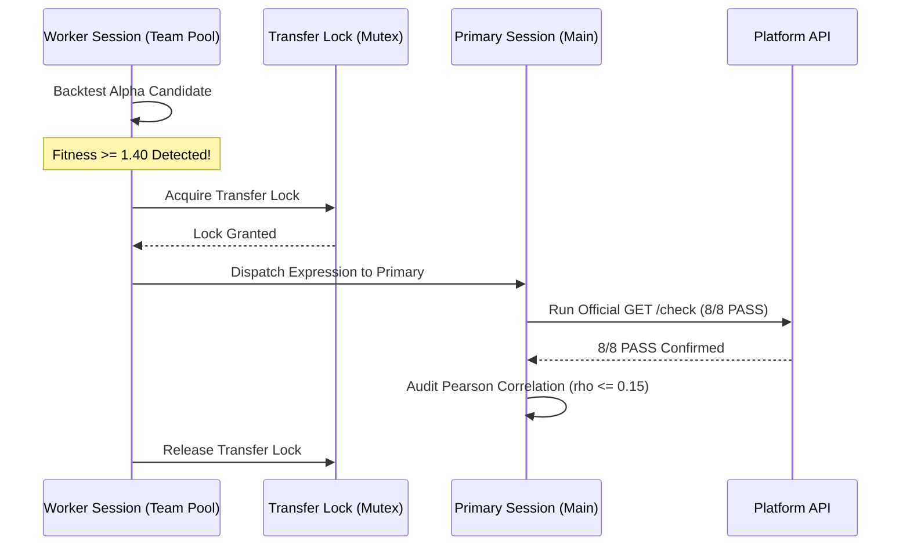

# System Architecture

**AlphaFind** is engineered natively in Rust to achieve high-throughput simulation dispatching, zero GC pause latency, and microsecond correlation auditing.

---

## 🏛️ High-Level 4-Tier Pipeline

```text
┌────────────────────────────────────────────────────────────────────────┐
│        TIER 1: TAXONOMY & ORTHOGONAL HYPOTHESIS ENGINE                 │
│                                                                        │
│   ├── src/taxonomy.rs        : 6 Economic Pillars & Hypothesis Gen     │
│   ├── docs/BRAIN_KNOWLEDGE_GRAPH.md : 66 Operators & Diagnostics       │
│   └── data/                  : Field Schemas & Profiling Metadata      │
└───────────────────────────────────┬────────────────────────────────────┘
                                    │
┌───────────────────────────────────┴────────────────────────────────────┐
│        TIER 2: DISTRIBUTED COMPUTE ENGINE (3 Accounts / 9 Workers)     │
│                                                                        │
│   ├── src/screener.rs        : Asynchronous Parallel Tokio 9-Workers   │
│   ├── src/client.rs          : Async BrainClient + Session Cookie Jar  │
│   ├── src/autotuner.rs       : Autonomous Decay Sweeps & Convex Opt    │
│   └── transfer_lock          : Thread-Safe Verification Lock on Main   │
└───────────────────────────────────┬────────────────────────────────────┘
                                    │
┌───────────────────────────────────┴────────────────────────────────────┐
│        TIER 3: CORRELATION ENGINE & AUDIT GUARD                        │
│                                                                        │
│   ├── src/correlation.rs     : Microsecond Pearson Matrix & Simulator  │
│   ├── ~/.cache/alphafind     : Disk-Cached Daily PnL Baseline          │
│   └── portfolio_os.json      : Master Active Out-of-Sample Portfolio   │
└───────────────────────────────────┬────────────────────────────────────┘
                                    │
┌───────────────────────────────────┴────────────────────────────────────┐
│        TIER 4: SUBMISSION VERIFICATION & DISPATCH                      │
│                                                                        │
│   ├── src/main.rs            : Unified High-Performance CLI            │
│   ├── GET /check             : Official 8/8 Mandatory PASS Engine      │
│   └── POST /submit           : Direct API Submission & Tagging         │
└────────────────────────────────────────────────────────────────────────┘
```

---

## ⚡ Asynchronous Concurrency & Worker Pooling Model

AlphaFind leverages the native Rust **Tokio async runtime** to execute parallel backtests with zero garbage collection overhead and deterministic memory allocation.

### Worker Architecture & Collaborative Pooling
AlphaFind scales worker execution efficiently:
* **Single-Account Mode (Standard)**: Runs 3 parallel asynchronous workers under one authenticated session, respecting platform rate limits with automated exponential backoff (`HTTP 429` backoff with jitter).
* **Multi-Session Team Pooling (Optional)**: For quantitative research labs and collaborative teams with multiple accounts, AlphaFind supports aggregating up to 9 parallel workers across designated sessions to scale exploration velocity.

| Session Role | Workers | Responsibilities |
|:---|:---:|:---|
| **Primary Session (Main)** | 3 Workers | Hypothesis verification, 1,236-day correlation audits, and official 8/8 submission (`/check`, `/submit`). |
| **Worker Session 1 (Team)** | 3 Workers | High-throughput exploratory screening, parameter grid sweeps, decay sweeps. |
| **Worker Session 2 (Team)** | 3 Workers | High-throughput exploratory screening, parameter grid sweeps, decay sweeps. |

---

## 🔒 Thread-Safe Atomic Transfer Lock

When a collaborative worker session discovers a high-conviction candidate ($\text{Fitness} \ge 1.40$ or potential 8/8 PASS), execution is automatically serialized onto the Primary submitting session:



This guarantees:
1. Candidate expressions from distributed exploratory workers are verified cleanly on the primary designated submitting account.
2. Official platform submission checks (`/check`) are strictly serialized without concurrency collisions.

---

## ⚡ Microsecond Pearson Correlation Engine

The portfolio correlation engine (`src/correlation.rs`) audits a candidate's 1,236-day PnL vector against all active Out-of-Sample alphas:

* **Vectorized Dot Product**: Computes Pearson product-moment correlation coefficient in microseconds:
  $$\rho_{X, Y} = \frac{\sum (X_i - \overline{X})(Y_i - \overline{Y})}{\sqrt{\sum (X_i - \overline{X})^2 \sum (Y_i - \overline{Y})^2}}$$
* **Local Disk Cache**: Daily PnL vectors are cached locally under `~/.cache/alphafind/` to eliminate redundant API round-trips.
* **Merged Sharpe Simulation**: Calculates aggregate portfolio returns, standard deviation, and merged Sharpe taking the full covariance matrix into account.

---

## 🎛️ Autonomous Parameter Auto-Tuner

The auto-tuner (`src/autotuner.rs`) maximizes annual return while controlling turnover:
1. **Decay Sweep**: Iterates over decay parameter ranges $[4, 34]$ to identify the optimal holding period.
2. **Convex Power Transformation**: Applies `signed_power(signal, p)` with $p \in [3.8, 4.4]$ to enhance conviction in top-decile predictions.
3. **Truncation Guard**: Dynamically clamps single-stock weight exposure to $0.065 - 0.07$ to guarantee passing `CONCENTRATED_WEIGHT` tests.
