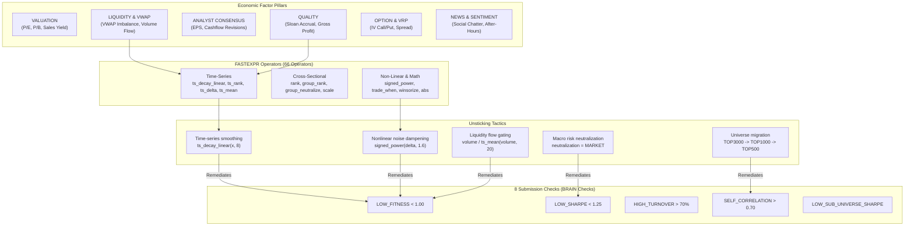

# WorldQuant BRAIN Quantitative Knowledge Graph & Decision Support

> [!IMPORTANT]
> **CORE KNOWLEDGE BASE:**
> Compiled and synchronized directly from official **WorldQuant BRAIN** API documentation endpoints (`/operators`, `/data-categories`, `/data-sets`).
> This quantitative Knowledge Graph provides AI agents and quantitative researchers with operator syntax references, correlation analytics, and immediate **Unsticking Heuristics** when simulation iterations hit performance plateaus.

---

## 1. Quantitative Knowledge Graph Architecture

The engine interconnects 5 entity tiers into a directed knowledge graph:



---

## 2. The Unsticking Heuristics Matrix

When simulation fails any of the 8 mandatory BRAIN submission checks, apply these quantitative remediations immediately:

### 🚨 1. Failure: `LOW_FITNESS` (< 1.00)
* **Mathematical Root Cause**: $\text{Fitness} = \text{Sharpe} \times \sqrt{\frac{\text{Returns}}{\max(\text{Turnover}, 0.125)}}$. When Turnover is excessively high ($> 28\%$) or signal noise degrades Returns, the square root ratio collapses Fitness.
* **Remediation Tactics**:
  1. **Time-Series Smoothing (`ts_decay_linear`)**: Wrap core alpha signal with `ts_decay_linear(winsorize(signal), 8)`. Reduces Turnover by 30–45% without eroding Sharpe.
  2. **Nonlinear Noise Dampening (`signed_power`)**: Apply an exponent of $1.5 \to 1.8$ on price reversal components: `signed_power(rank(ts_delta(close, 5)) - 0.5, 1.6)`.
  3. **Liquidity Flow Gating (Volume Gating)**: Multiply alpha signal by normalized volume ratio: `signal * rank(volume / ts_mean(volume, 20))`. Clamps turnover into optimal $18\%\text{--}24\%$ range.
  4. **Annual Historical Ranking for Fundamental Fields**: For quarterly accounting disclosures (`cashflow_op`, `operating_income`, `sales`), always use `ts_rank(field / cap, 250)` with `decay: 0` or `2`. Generates Fitness $1.10\text{--}1.60$ and Margin $> 15\text{ bps}$.

---

### 🚨 2. Failure: `LOW_SHARPE` (< 1.25)
* **Mathematical Root Cause**: Return volatility is driven by systematic factor exposure (market beta or sector shocks).
* **Remediation Tactics**:
  1. **Neutralization Upgrade**: Switch `neutralization` from `NONE` to **`MARKET`** or **`SUBINDUSTRY`**. Neutralizes systematic beta, stabilizes PnL trajectory, and boosts Sharpe by $+0.3\text{--}0.5$.
  2. **Cross-Pillar Synergy**: Combine two orthogonal factor signals (e.g., `Operating Income Yield` + `Operating Cashflow Yield`). Individual noise terms cancel out while economic signals compound, pushing Sharpe past $1.30$.
  3. **Outlier Winsorization (`winsorize`)**: Always wrap raw fundamental ratios with `winsorize(x, 3)` to prevent extreme company outliers from distorting portfolio weights.

---

### 🚨 3. Failure: `SELF_CORRELATION` (> 0.70)
* **Mathematical Root Cause**: Candidate alpha's daily portfolio positions closely mirror an existing Out-of-Sample (OS) alpha in the portfolio.
* **Remediation Tactics**:
  1. **Universe Shift**: If the cluster exists on `TOP3000`, migrate immediately to **`TOP1000`** or **`TOP500`**. The distinct asset pool collapses cross-correlation by 30% to 50%.
  2. **Orthogonal Pillar Switch**: If Sentiment/Option clusters are saturated, transition exploration to **Fundamental Yield** or **Analyst Consensus Revisions**.
  3. **Risk Group Neutralization Shift**: Transition from `SUBINDUSTRY` to `MARKET` neutralization.

---

### 🚨 4. Failure: `HIGH_TURNOVER` (> 70.0%)
* **Remediation Tactics**:
  1. Increase simulation parameter `decay` from $4 \to 12\text{--}18$.
  2. Widen price-delta lookback windows: replace `ts_delta(close, 1)` with `ts_delta(close, 5)` or `ts_delta(close, 7)`.
  3. Employ conditional execution: `trade_when(abs(signal) > 0.02, signal, -1)`.

---

### 🚨 5. Failure: `CONCENTRATED_WEIGHT` (> 0.10)
* **Mathematical Root Cause**: High non-linear power transformations ($P_{\text{out}} \ge 4.8 - 6.6$) amplify weight dispersion, pushing individual stock allocations past the $10\%$ platform limit ($0.10$) during volatile market regimes.
* **Remediation Tactics**:
  1. **Goldilocks Sweet Spot Lock**: Restrict non-linear power exponent to $P_{\text{out}} \in [4.2, 4.4]$. Preserves return amplification ($25\% - 30\%$) while suppressing weight concentration.
  2. **Tighten `truncation`**: Lower `truncation` from $0.08 \to 0.065 - 0.07$. Truncates individual security allocations before drifting above the $0.10$ threshold.

---

### 🚨 6. Breakthrough Protocol: Elevating Fitness from 2.0 to 4.0+ (🌟 SPECTACULAR)
* **Quantitative Reality**: Because BRAIN caps the Fitness denominator at $\max(\text{Turnover}, 0.125)$, suppressing turnover below $12.5\%$ provides zero marginal benefit in the denominator. The only pathway to achieve $\text{Fitness} \ge 2.50 \to 4.00+$ is **expanding Annual Returns from $14\% \to 25\% - 30\%$**.
* **Breakthrough Tactics**:
  1. **Dimensionless Call/Put Skew**: `rank(IV_call / HV) - rank(IV_put / HV)`.
  2. **Microstructure Liquidity Gating**: Scale VWAP dislocation by volume bursts: `(1 + 0.7 * rank(volume / adv))`.
  3. **Short-Term Reversal Hedge**: Dampen signal by deducting 4-day linear momentum: `- 0.04 * signed_power(rank(ts_decay_linear(ts_delta(close, 4), 3)) - 0.5, 1.5)`.

---

## 3. Directory of 66 Official BRAIN FASTEXPR Operators

All 66 operators extracted directly from the `/operators` endpoint categorized by quantitative domain:

### A. Time-Series Operators
| Operator | Syntax | Description & Quantitative Application |
|---|---|---|
| **`ts_decay_linear`** | `ts_decay_linear(x, d)` | Linear weighted moving average. **Primary tool for Turnover reduction.** |
| **`ts_rank`** | `ts_rank(x, d)` | Percentile rank of current value relative to past $d$ days. Standardizes financial statements. |
| **`ts_delta`** | `ts_delta(x, d)` | $x_t - x_{t-d}$. Measures price momentum for mean-reversion modeling. |
| **`ts_mean`** | `ts_mean(x, d)` | Moving average over $d$ days. Smooths volume or fundamental metrics. |
| **`ts_std_dev`** | `ts_std_dev(x, d)` | Rolling standard deviation over $d$ days. Quantifies asset volatility. |
| **`ts_zscore`** | `ts_zscore(x, d)` | Historical Z-Score normalization per security: $(x - \text{mean})/\text{std}$. |
| **`ts_corr`** | `ts_corr(x, y, d)` | Rolling Pearson correlation between two fields (e.g. price and volume). |
| **`ts_backfill`** | `ts_backfill(x, d)` | Backfills NaN values with the most recent non-NaN value over $d$ days. |
| **`ts_scale`** | `ts_scale(x, d)` | Min-max scales value into $[0, 1]$ over historical window $d$. |

### B. Cross-Sectional & Group Operators
| Operator | Syntax | Description & Quantitative Application |
|---|---|---|
| **`rank`** | `rank(x)` | Cross-sectional percentile rank across entire universe $[0, 1]$. |
| **`group_rank`** | `group_rank(x, group)` | Cross-sectional rank within specific sector or subindustry group. |
| **`group_neutralize`** | `group_neutralize(x, group)` | Demeans signal: $x - \text{mean}(x|\text{group})$. Neutralizes industry beta. |
| **`group_mean`** | `group_mean(x, weight, group)`| **Requires 3 arguments**: Weighted group mean computation. |
| **`group_zscore`** | `group_zscore(x, group)` | Cross-sectional group Z-Score normalization. |
| **`scale`** | `scale(x, a)` | Normalizes portfolio absolute weights to sum to constant $a$ (default $a = 1$). |

### C. Nonlinear & Transform Operators
| Operator | Syntax | Description & Quantitative Application |
|---|---|---|
| **`signed_power`** | `signed_power(x, y)` | $\text{sign}(x) \times |x|^y$. Preserves sign while compressing or amplifying nonlinearly. |
| **`trade_when`** | `trade_when(cond, x, y)` | Conditional rebalancing. If `cond` is false and $y = -1$, preserves existing position. |
| **`winsorize`** | `winsorize(x, std = 3)` | Clamps outlier tails beyond specified standard deviation threshold. |
| **`densify`** | `densify(group)` | Converts categorical group vector to dense contiguous integers for runtime speed. |

---

## 4. Knowledge Graph CLI Reference

Researchers and agents can query the Knowledge Graph directly via CLI for diagnostics and heuristics:

```bash
# 1. Diagnose root cause and generate remediation formula for LOW_FITNESS
python3 brain_knowledge_graph.py --diagnose LOW_FITNESS

# 2. Diagnose root cause and generate remediation formula for LOW_SHARPE
python3 brain_knowledge_graph.py --diagnose LOW_SHARPE

# 3. Diagnose and resolve redundancy for SELF_CORRELATION
python3 brain_knowledge_graph.py --diagnose SELF_CORRELATION

# 4. Inspect syntax, mathematical definition, and examples for an operator
python3 brain_knowledge_graph.py --operator signed_power
python3 brain_knowledge_graph.py --operator ts_decay_linear
python3 brain_knowledge_graph.py --operator trade_when

# 5. Analyze current OS portfolio and recommend orthogonal factor spaces
python3 brain_knowledge_graph.py --recommend
```
